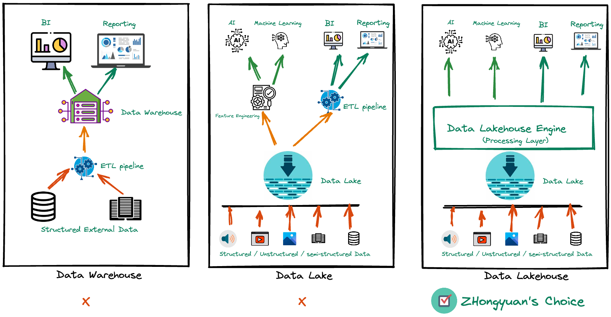
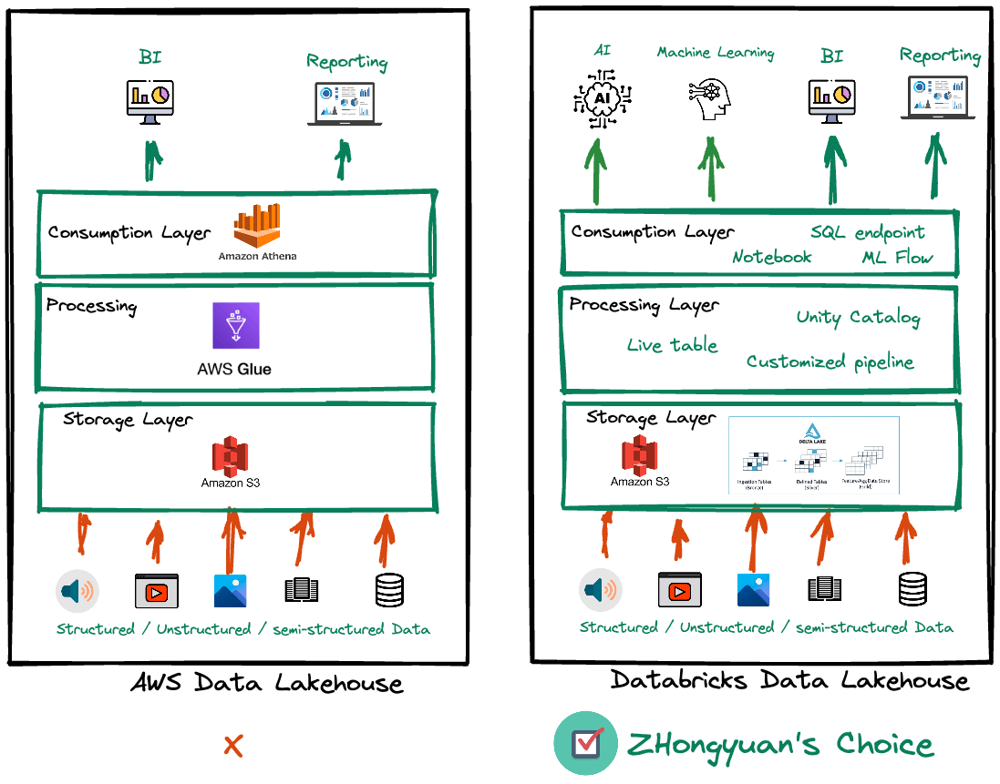
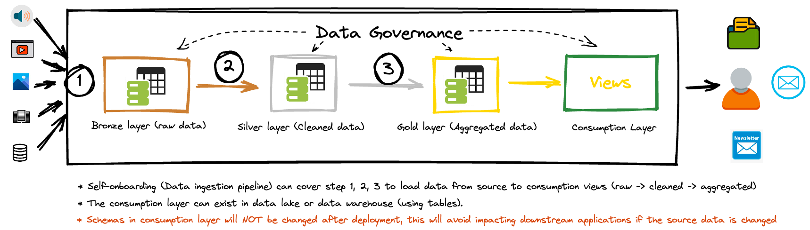

# Databook Data Management System Design Challenge

### Author: Zhongyuan(Thomas) Li
### Date: 2022/08/28
<br><br/>
## How you would approach such a project?

1. Get all the requirements in this project.
2. List possible solution(s)/technologies for each item in the requirement list
3. Pick the one (or multiple solutions) that can cover all the requirements

### Requirements and proposed solutions
1. The system will encapsulate existing SQL, NoSQL databases, a large corpus of PDFs, along with any necessary future database technologies.
   - **Solution**: DataLake which can handle structured, unstructured and semi-structured data.
<br><br/>
2. Downstream applications (e.g. mobile app, web site, ML training) should be agnostic to where data comes from.
   - **Solution**: Downstream users can get data from Database, Data warehouse, Datalake or Data Lakehouse, and do not have to know where data comes from.
<br><br/>
3. Non-technical users should be able to self-serve to add and manage new datasets.
   - **Solution**: Non-technical users can onboard and manage data via a user-friendly UI or API 
<br><br/>
4. The platform will automate ingesting of these datasets.
   - **Solution**: Job orchestration tool (Airflow, Databricks, Snowflake pipeline, etc..) can be used to schedule data ingestion pipelines. Engineers do NOT have to manually trigger them.
<br><br/>
5. The system will expose a unified data addressing approach.
   - **Solution**: Catalog/Schema or any other metadata system can be used to describe a databases, table or even a column (field).
<br><br/>
6. Data points can be associated with particular entities (e.g. Companies, Executives, Industries) and can be accessed to be embedded in templated documents.
   - **Solution for data availability**: Data governance (via AWS IMA or Databricks Unity Catalog) will control the accessibility of data sets. Only the user(s) with specific permission can access the data. 
   - **Solution for accessing**: Data can be accessed via files (CSV, PDF, Google Sheet), dashboard, or newsletter based on given template.
<br><br/>
7. Non-technical users can create expressions to aggregate data points.
   - **Solution**: Non-technical users can use interactive dashboard to get the data they want. Or SQL endpoint (if users know how to write query)
<br><br/>
8. Dependent data points will be updated automatically.
   - **Solution**: Cross-table transaction mechanism or real-time data loading can keep the dependent table(s) updated.
<br><br/>
9. Users should be able to retrieve the state of data at arbitrary points in time.
   - **Solution**: SLA, pipeline monitoring/alert system, or data quality framework can be used to check the data ingestion status
<br><br/>
10. The system should be fast enough to support interactive use cases.
    - **Solution**: Big data or any other query performance optimization can be used for high-performance data query.
<br><br/>
11. It should be easy for other parts of the stack to make use of this system.
    - **Solution**: system scalability and interface with other systems
<br><br/>

## Questions you would ask?
1. **Data volume(size)**: 
   - How big the whole data set is (For snapshot loading)?
   - How big a daily/hourly incremental loading will be? (For incremental loading, or CDC) 
   - What is the requirement of data refreshing (frequency)? (Weekly, Daily, Hourly, or Real time)
<br><br/>
2. **Data source(s)**:
   - Where does the source data (files) exist? (API, PDF in S3, FTP server, etc..)
   - What is the credential to collect the data?
   - When the data will be ready? (For daily or hourly loading case)
<br><br/>
3. **Data format**: Non-structured data, PDF file format, etc..
   - What is the file name format?
   - What is the schema of the source data?
   - When and how the data format get update?
<br><br/>
4. **Downstream application**:
   - When the downstream application consume the data?
   - Teams/Users and their permissions on different dataset.
<br><br/>
5. **Files**
   - What does the *templated document* mean? 
   - Do you mean files like (CSV, JSON, PDF, or Google Sheet with some template)? 
   - How to deliver them? (Via email, api, or file delivery) 
   - Can we use dashboard to show the data?
<br><br/>
6. **Non-Technical User**
   - Can those users user SQL?
   - How do they create expressions? 
<br><br/>
7. **Data Status**
   - What status of data loading are needed?
   - Completion only? Or include Data Quality (Like row count comparison)?
<br><br/>
8. **Integration with other systems**
   - How does other part of the stack use this system?
   - Only use the data or use the computation, storage, ML, BI, etc..?

## The resource that you would need?
1. **Communication**: 
   - Points of Contact from Source data and downstream application teams.
2. **Sample Data from source**:
   - Need the sample data from all data sources
3. **Downstream Application**:
   - Template or schema of data deliveries
4. **Data Modeling**: 
   - Dependencies and relation among different data
5. **Testing**: 
   - All details of testing destinations (Where should I send data for testing?)
6. **Sign-Off**: 
   - Acceptance criteria, SLA and validation process (who, when and how?)
7. **Plan/MileStones**:
   - Deadline and milestones at each stage (plan and tasks), documentations.
8. **Engineering Source**: 
   - Engineers

## The technologies you would consider?
### Infra Level
   - Since there is a requirement mentioning that different data types (SQL, NoSQL, PDF, etc..) will be loaded into the data system, data warehouse and database may not good solutions for this data management system.
   - Data lake or data lakehouse can be used to store and process different types of data (structured, unstructured, or semi-structured)
   - In addition, it also requires that non-technical users could add and mange data, as well as integration with other systems. So a **Data LakeHouse** may be a better choice for this project. 



### Tools/Technologies
There are many available data lakehouse solutions which can be used in this project, like AWS S3 based data lakehouse and Databricks lakehouse. 



## How you would execute against the implementation?
1. **Data Ingestion** *: Read data from source and load raw data (**Without any change**) into tables at Bronze layer in data lake
2. **Data transformation**: Clean/transform/join raw data and save cleaned result to tables at Silver layer
3. **Data aggregation**: Save aggregated data into tables at gold layer for AI, BI, or Reporting
4. **Consumption Layer** *: Create **views** at the consumer layer and use those views as interfaces with downstream applications. 
5. **Data governance**: Utilize UC (Unity Catalog) to grant users permissions on each database, table, column
6. **Data visualization**: Create dashboard (with different permission) for specific entity based on the template




````commandline
Data ingestion: Utilize live table or customized ingestion engine for data self-onboarding
Consumption Layer: Views at consumption layer will NOT be changed. This will avoid impacting downstream applications if there is any change from the data source or pipeline. 
````
### Development and Testing Plan
1. Build self-serve data ingestion pipeline (or engine) to load data
2. Validate data at each step (bronze, silver, gold)
3. Apply data governance to manage data accessibility
4. Deliver testing results to users and ask data validation
5. Create SLA and data quality to monitor jobs and send alerts for any failure
6. Deploy the above steps into Prod
7. Sign-off
